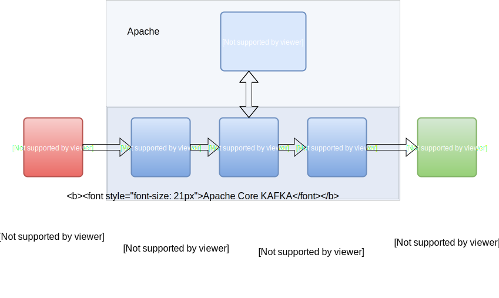

# Kafka Fun

Kafka is used for real-time streams of data, to collect big data, or to do real time analysis (or both). Kafka is used with in-memory microservices to provide durability and it can be used to feed events to CEP (complex event streaming systems) and IoT/IFTTT-style automation systems

## Kafka Architecture: Core Kafka

  

## Why Kafka ?

Kafka is often used in real-time streaming data architectures to provide real-time analytics. Since Kafka is a fast, scalable, durable, and fault-tolerant publish-subscribe messaging system, Kafka is used in use cases where JMS, RabbitMQ, and AMQP may not even be considered due to volume and responsiveness.

**Kafka has higher throughput, reliability, and replication characteristics,** which makes it applicable for things like tracking service calls (tracks every call) or tracking IoT sensor data where a traditional MOM might not be considered.

Kafka can work with Flume/Flafka, Spark Streaming, Storm, HBase, Flink, and Spark for real-time ingesting, analysis and processing of streaming data. Kafka is a data stream used to feed Hadoop BigData lakes. Kafka brokers support massive message streams for low-latency follow-up analysis in Hadoop or Spark. Also, Kafka Streams (a subproject) can be used for real-time analytics.

## Kafka Use Cases

In short, **Kafka is used for stream processing**, website activity tracking, metrics collection and monitoring, log aggregation, real-time analytics, CEP, ingesting data into Spark, ingesting data into Hadoop, CQRS, replay messages, error recovery, and guaranteed distributed commit log for in-memory computing (microservices).

## Content 

- Kafka Basics# kafka-fun
