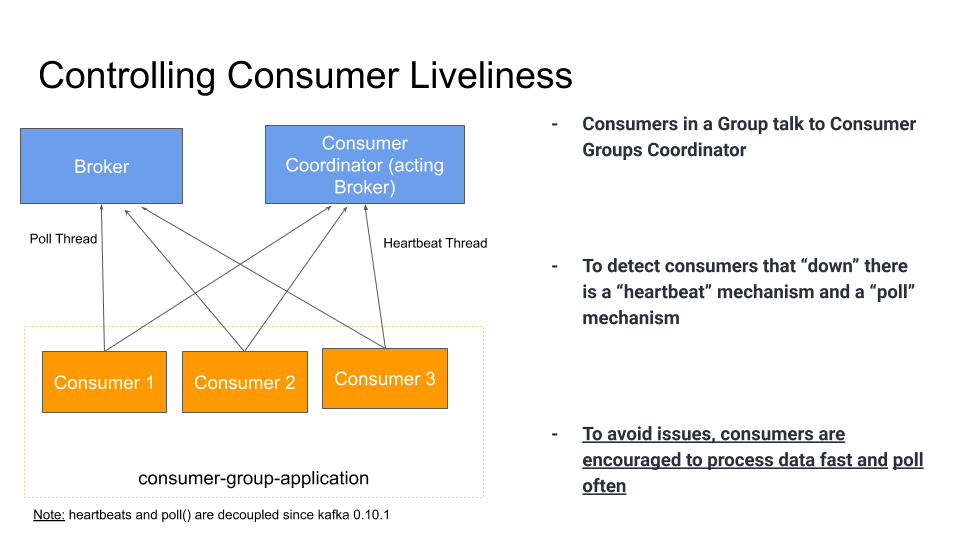

# Kafka Producer Twitter

<p align="center">
  
</p>

## Setup 

1. Download and Setup Java 8 JDK:
    ``` sudo apt install openjdk-8-jdk ```
2. Download & Extract the Kafka binaries from https://kafka.apache.org/downloads
3. Try Kafka commands using ```bin/kafka-topics.sh``` (for example)
4. Edit PATH to include Kafka (in ```~/.bashrc``` for example) ```PATH="$PATH:/your/path/to/your/kafka/bin ```
5. Edit Zookeeper & Kafka configs using a text editor
zookeeper.properties: ```dataDir=/your/path/to/data/zookeeper```
server.properties: ```log.dirs=/your/path/to/data/kafka```
6. Start Zookeeper in one terminal window: ```zookeeper-server-start.sh config/zookeeper.properties```
7. Start Kafka in another terminal window: ```kafka-server-start.sh config/server.properties```

8. Create the topic that will be used

```kafka-topics.sh --zookeeper 127.0.0.1:2181 --create --topic twitter_tweets --partitions 6 --replication-factor 1```

9. Start the consumer

```kafka-console-consumer.sh --bootstrap-server 127.0.0.1:9092 --topic twitter_tweets```

10. Before run the main class, you need to create an application in https://developer.twitter.com/  and take your keys and tokens

Set the variables: 

- BONSAI_ELASTICSEARCH_URL
- BONSAI_ELASTICSEARCH_ACCESS_TOKEN
- BONSAI_ELASTICSEARCH_ACCESS_TOKEN_SECRET


## For more information

Used Elasticsearch - 

- Manual installation: https://www.elastic.co/guide/en/elasticsearch/reference/current/getting-started-install.html

- Elasticsearch on Demand - 3-node-cluster: https://bonsai.io/ - 

## Delivery Semantics

- At most once: offsets are committed as soon as the message batch is received. If the processing goes wrong, the message will be lost (it won't be read again).
- At least once: offsets are committed after the message is processed. If the processing goes wrong, the message will be read again. This can result in duplicate processing of messages. Make sure your processing
is idempotent (i.e processing again the messages won't impact your systems)
- Exactly once: Can be achieved for Kafka => Kafka workflows using Kafka Streams API. For Kafka => Sink workflows, use an idempotent consumer.

## Consumer Poll Behavior

- Kafka consumers have a "poll" model, while many other messaging bus is enterprises have a "push" model.
- This allows consumers to control where in the log they want to consume, how fast, and gives them the ability to replay events.
- Fetch.min.bytes (default 1):
    - Controls how much data you want to pull at least on each request
    - Helps improving throughput and decreasing request number
    - At the cost of latency
- Max.poll.records (default 500):
    - Controls how many records to receive per poll request
    - Increase if your messages are very small and have a lot of available RAM
    - Good to monitor how many records are polled per request
- Max.partitions.fetch.bytes (default 1MB):
    - Maximum data returned by the broker per partition
    - If you read from 100 partitions, you'll need a lot of memory (RAM)
- Fetch.max.bytes (default 50MB):
    - Maximum data returned for each fetch request (covers multiple partitions)
    - The consumer performs multiple fetches in parallel
    
***- Change these settings only if your consumer maxes out on throughput already***

## Consumer Offset Commits Strategies

- There are two most common patterns for committing offsets in a application

- 2 strategies:
    - (easy) enable.auto.commit = true & synchronous processing of batches
    - (medium) enable.auto.commit = false & manual commit of offsets
        - You control when you commit offsets and what's the condition for committing them.
        - Example: accumulating records into a buffer and then flushing the buffer to a database + committing offsets then.
    
- With auto-commit, offsets will be committed automatically for you at regular interval (auto.commit.interval.ms=5000 by default) every-time you call .poll()
- If you don't use synchronous processing, you will be in "at-most-once" behavior because offsets will be committed before your data is processed

## Consumer Offset Reset Behaviour

- A consumer is expected to read from a log continuously.
- But if your application has a bug, your consumer can be down
- If Kafka has a retention of 7 days, and your consumer is down for more than 7 days, the offsets are "invalid"
- The behavior for the consumer is to then use:
    - auto.offset.reset=latest: will read from the end of the log
    - auto.offset.reset=earliest: will read from the start of the log
    - auto.offset.reset=none: will throw exception if no offset is found
    
- Additionally, consumer offsets can be lost:
    - If a consumer hasn't read new data in 1 day (Kafka < 2.0)
    - If a consumer hasn't read new data in 7 day (Kafka >= 2.0)
**- This can be controlled by the broker setting offset.retention.minutes**

## Replaying data for Consumers
   
- To replay data for a consumer group:
    - Take all the consumers from a  specific group down
    - Use 'kafka-consumers-groups' command to set offset to what you want
    - Restart consumers
    
* Bottom line:
    * Set proper data retention period & offset retention period ( the default is 7 days but you can set 1 month if you want to be super safe)
    * Ensure the auto offset reset behavior is the one you expect / want
    * Use replay capability in case of unexpected behavior

## CLI Command to replay data

``` kafka-consumer-groups.sh --bootstrap-server 127.0.0.1:9092 --group kafka-demo-elasticsearch --reset-offsets --execute --to-earliest --topic twitter_tweets ```

## Controlling Consumer Liveliness (Good to know)

<p align="center">
  
</p>

## Consumer Heartbeat Thread

- **- Session.timeout.ms (default 10 seconds):**
    * Heartbeats are sent periodically to the broker
    * If no heartbeat is sent during that period, the consumer is considered dead
    * Set even lower to fast consumer rebalances
- **Heartbeat.interval.ms (default 3 seconds):**
    * How often to send heartbeats
    * Usually set to 1/3 of session.timeout.ms

**- Take-away: This mechanism is used to detect a consumer application being down**

## Consumer Poll Thread

- **max.poll.interval.ms(default 5 minutes):**
    - Maximum amount of time between two .poll() calls before declaring the consumer dead
    - This is particularly relevant for Big Data frameworks like Spark in case the processing takes time
    
**- Take-away: This mechanism is used to detect a data processing issue with the consumer**