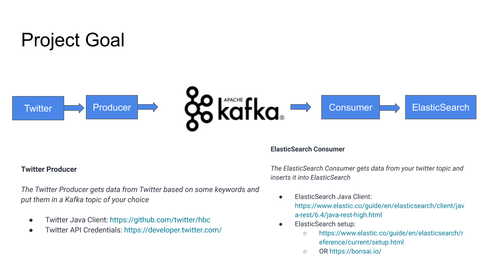

# Kafka Producer Twitter

<p align="center">
  
</p>

## Setup 

1. Download and Setup Java 8 JDK:
    ``` sudo apt install openjdk-8-jdk ```
2. Download & Extract the Kafka binaries from https://kafka.apache.org/downloads
3. Try Kafka commands using ```bin/kafka-topics.sh``` (for example)
4. Edit PATH to include Kafka (in ```~/.bashrc``` for example) ```PATH="$PATH:/your/path/to/your/kafka/bin ```
5. Edit Zookeeper & Kafka configs using a text editor
zookeeper.properties: ```dataDir=/your/path/to/data/zookeeper```
server.properties: ```log.dirs=/your/path/to/data/kafka```
6. Start Zookeeper in one terminal window: ```zookeeper-server-start.sh config/zookeeper.properties```
7. Start Kafka in another terminal window: ```kafka-server-start.sh config/server.properties```

8. Create the topic that will be used

```kafka-topics.sh --zookeeper 127.0.0.1:2181 --create --topic twitter_tweets --partitions 6 --replication-factor 1```

9. Start the consumer

```kafka-console-consumer.sh --bootstrap-server 127.0.0.1:9092 --topic twitter_tweets```

10. Before run the main class, you need to create an application in https://developer.twitter.com/  and take your keys and tokens

Set the variables: 

- BONSAI_ELASTICSEARCH_URL
- BONSAI_ELASTICSEARCH_ACCESS_TOKEN
- BONSAI_ELASTICSEARCH_ACCESS_TOKEN_SECRET


## For more information

Used Elasticsearch - 

- Manual installation: https://www.elastic.co/guide/en/elasticsearch/reference/current/getting-started-install.html

- Elasticsearch on Demand - 3-node-cluster: https://bonsai.io/ - 