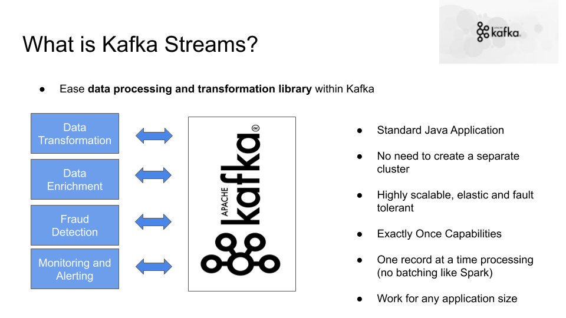
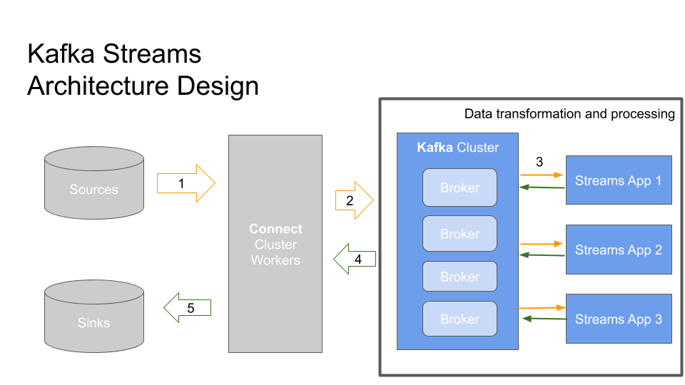

# Kafka Streams Filter Tweets

<p align="center">
  
</p>

## Setup 

1. Download and Setup Java 8 JDK:
    ``` sudo apt install openjdk-8-jdk ```
2. Download & Extract the Kafka binaries from https://kafka.apache.org/downloads
3. Try Kafka commands using ```bin/kafka-topics.sh``` (for example)
4. Edit PATH to include Kafka (in ```~/.bashrc``` for example) ```PATH="$PATH:/your/path/to/your/kafka/bin ```
5. Edit Zookeeper & Kafka configs using a text editor
zookeeper.properties: ```dataDir=/your/path/to/data/zookeeper```
server.properties: ```log.dirs=/your/path/to/data/kafka```
6. Start Zookeeper in one terminal window: ```zookeeper-server-start.sh config/zookeeper.properties```
7. Start Kafka in another terminal window: ```kafka-server-start.sh config/server.properties```

8. Create the topic that will be used

```kafka-topics.sh --zookeeper 127.0.0.1:2181 --create --topic twitter_tweets --partitions 6 --replication-factor 1```

```kafka-topics.sh --zookeeper 127.0.0.1:2181 --topic important_tweets --create --partitions 3 --replication-factor 1```

9. Start the consumer to check the stream result

```kafka-console-consumer.sh --bootstrap-server 127.0.0.1:9092 --topic important_tweets```


## Kafka Streams Introduction

- You want to do the following from the 'twitter_tweets' topic:
    - Filter only tweets that have over 10 likes or replies
    - Count the number of tweets received for each hashtag every 1 minute
- Or combine the two to get trending topics and hashtags in real time!
- With Kafka Producer and Consumer, you can achieve that but it's very low level and not developer friendly

## Kafka Streams Architecture Design

<p align="center">
  
</p>

